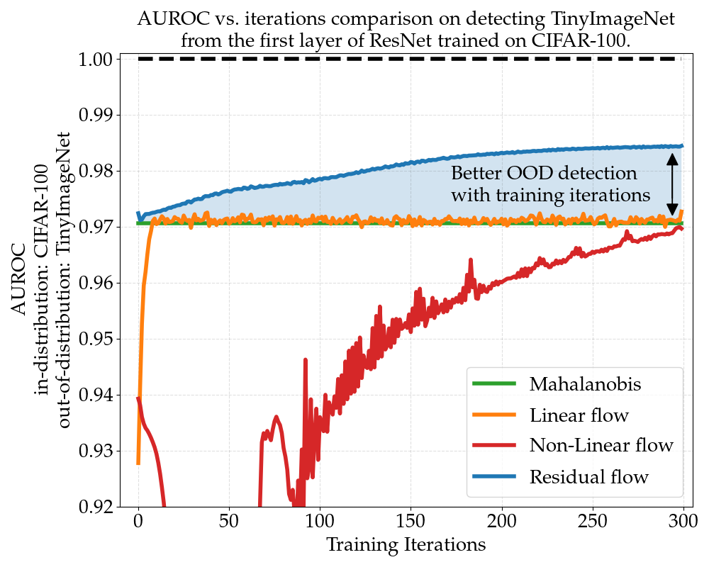

# Deep Residual Flow for Out of Distribution Detection
An implementation of the Residual Flow algorithm for out-of-distribution detection \[[arXiv](https://arxiv.org/abs/2001.05419)\]
. 
Some code was adopted from [deep_Mahalanobis_detector](https://github.com/pokaxpoka/deep_Mahalanobis_detector) and [RealNVP](https://github.com/tensorflow/models/tree/master/research/real_nvp).

<p align="center">
    
</p>

## Citing Residual Flow for OOD Detection 
```
E. Zisselman, A. Tamar. "Deep Residual Flow for Out of Distribution Detection". CVPR 2020.
``` 
```
@InProceedings{Zisselman_2020_CVPR,
    author = {Zisselman, Ev and Tamar, Aviv},
    title = {Deep Residual Flow for Out of Distribution Detection},
    booktitle = {The IEEE Conference on Computer Vision and Pattern Recognition (CVPR)},
    month = {June},
    year = {2020}
}
```

## Dependencies
Tested on Ubuntu Linux 18.04.04 and Python 3.7, and requires the following dependencies:

* [PyTorch](http://pytorch.org/): Requires 1 GPU with CUDA 10.2 support.
* [scipy](https://github.com/scipy/scipy)
* [scikit-learn](http://scikit-learn.org/stable/)

## Links for downloading Out-of-Distribution Datasets
The datasets from [odin-pytorch](https://github.com/facebookresearch/odin):

* [Tiny-ImageNet (resize)](https://www.dropbox.com/s/kp3my3412u5k9rl/Imagenet_resize.tar.gz)
* [LSUN (resize)](https://www.dropbox.com/s/moqh2wh8696c3yl/LSUN_resize.tar.gz)

are to be placed in `./data/`.

## Links for downloading Pre-trained Classification Networks
The pre-trained neural networks are from [deep_Mahalanobis_detector](https://github.com/pokaxpoka/deep_Mahalanobis_detector):  
1. DenseNet trained on CIFAR-10, CIFAR-100 and SVHN.
    * [DenseNet-CIFAR-10](https://www.dropbox.com/s/pnbvr16gnpyr1zg/densenet_cifar10.pth?dl=0) / [DenseNet-CIFAR-100](https://www.dropbox.com/s/7ur9qo81u30od36/densenet_cifar100.pth?dl=0) / [DenseNet-SVHN](https://www.dropbox.com/s/9ol1h2tb3xjdpp1/densenet_svhn.pth?dl=0)  
      
2. ResNet trained on CIFAR-10, CIFAR-100 and SVHN.
    * [ResNet-CIFAR-10](https://www.dropbox.com/s/ynidbn7n7ccadog/resnet_cifar10.pth?dl=0) / [ResNet-CIFAR-100](https://www.dropbox.com/s/yzfzf4bwqe4du6w/resnet_cifar100.pth?dl=0) / [ResNet-SVHN](https://www.dropbox.com/s/uvgpgy9pu7s9ps2/resnet_svhn.pth?dl=0)

To be placed in `./pre_trained/`.

## Links for downloading Pre-trained Residual Flow Networks
We provide six pre-trained residual flow networks for OOD detection for ResNet and DenseNet:

1. DenseNet trained on CIFAR-10, CIFAR-100 and SVHN.
* [Residual Flow for DenseNet-CIFAR-10](https://technionmail-my.sharepoint.com/:u:/g/personal/ev_zis_campus_technion_ac_il/EXaDW_xbU0BAhOgxfbj1loMBmIHPYQuoJSPmImSqSeyJhA?e=VumZEY) / [Residual Flow for DenseNet-CIFAR-100](https://technionmail-my.sharepoint.com/:u:/g/personal/ev_zis_campus_technion_ac_il/EaJu3Nkc_29Pi-odyTWUnKABGGcHJ04Yo9v8wrThUYmjug?e=scIlc2) / [Residual Flow for DenseNet-SVHN](https://technionmail-my.sharepoint.com/:u:/g/personal/ev_zis_campus_technion_ac_il/ESVdpBLM-b9EizVulcWbFLkBA101mYPK0KBJvRwT_N_kdw?e=azcjjK)

2. ResNet trained on CIFAR-10, CIFAR-100 and SVHN.
* [Residual Flow for ResNet-CIFAR-10](https://technionmail-my.sharepoint.com/:u:/g/personal/ev_zis_campus_technion_ac_il/EcwqtRASutFBphwR4s4NF8ABwgjdD_tJ4Zj5dLjLq8PKMw?e=iYUYZr) / [Residual Flow for ResNet-CIFAR-100](https://technionmail-my.sharepoint.com/:u:/g/personal/ev_zis_campus_technion_ac_il/EYpuBvexU_1Jg156O_v7hEIBZz5EtfQAqQSuI6saLV-zOA?e=b3YKJY) / [Residual Flow for ResNet-SVHN](https://technionmail-my.sharepoint.com/:u:/g/personal/ev_zis_campus_technion_ac_il/EbgPAwWgda9PiVXrd0bBFuMBAQSUXfTgbgaTzT4EtjfhXw?e=iYB5KE)

To be placed in `./output/`.

## Detecting Out-of-Distribution Samples (validate on OOD samples)
Example usage of residual flow targeting ResNet trained on CIFAR-10.  
Settings: 1x GPU (index 0)
### 1. Feature extraction
```
# extract feature activations from classification network 
python Residual_flow_prepare.py --dataset cifar10 --net_type resnet --gpu 0
```

### 2. Residual Flow training (optional)
Place the pre-trained residual flow networks (ResNet, CIFAR-10) in `./output/` or train the networks using the following:

Note: Each layer is trained individually using the flag `--layer n ` where 'n' is the layer index [0..N]
```
# (optional - you may use the pre-trained networks above) 

# Residual Flow training - trained per target network layer [0..N]
#                          where N = 3 for DenseNet and N = 4 for ResNet 
python Residual_flow_train.py --num_iter 2000 --net_type resnet --dataset cifar10 --layer 0 --gpu 0
```

### 3. Extract Residual Flow score for OOD detection
```
python Residual_flow_test_processing.py --net_type resnet --dataset cifar10

# (optional) comparison with Mahalanobis detector
python OOD_Generate_Mahalanobis.py --dataset cifar10 --net_type resnet --gpu 0
```

### 4. Train a simple regression detector
```
python OOD_Regression_Residual_flow.py --net_type resnet

# (optional) comparison with Mahalanobis detector
python OOD_Regression_Mahalanobis.py --net_type resnet
```


## Detecting Out-of-Distribution Samples (validate on FGSM samples)

### 1. Feature extraction
```
# generate the adversarial samples
python ADV_Samples_FGSM.py

# extract feature activations from classification network 
python Residual_flow_prepare.py --dataset cifar10 --net_type resnet --gpu 0 --validation_src FGSM
```

### 2. Residual Flow training (optional)
Place the pre-trained residual flow networks (ResNet, CIFAR-10) in `./output/` or train the networks using the following:

Note: Each layer is trained individually using the flag `--layer n ` where 'n' is the layer index [0..N]
```
# (optional - you may use the pre-trained networks above) 

# Residual Flow training - trained per target network layer [0..N]
#                          where N = 3 for DenseNet and N = 4 for ResNet 
python Residual_flow_train.py --num_iter 2000 --net_type resnet --dataset cifar10 --layer 0 --gpu 0
```

### 3. Extract Residual Flow score for OOD detection
```
python Residual_flow_test_processing.py --net_type resnet --dataset cifar10 --validation_src FGSM

# (optional) comparison with Mahalanobis detector
python ADV_Generate_Mahalanobis.py.py --dataset cifar10 --net_type resnet --gpu 0
```

### 4. Train a simple regression detector
```
python OOD_Regression_Residual_flow_FGSM_validation.py --net_type resnet

# (optional) comparison with Mahalanobis detector
python OOD_Regression_Mahalanobis_FGSM_validation.py --net_type resnet
```
