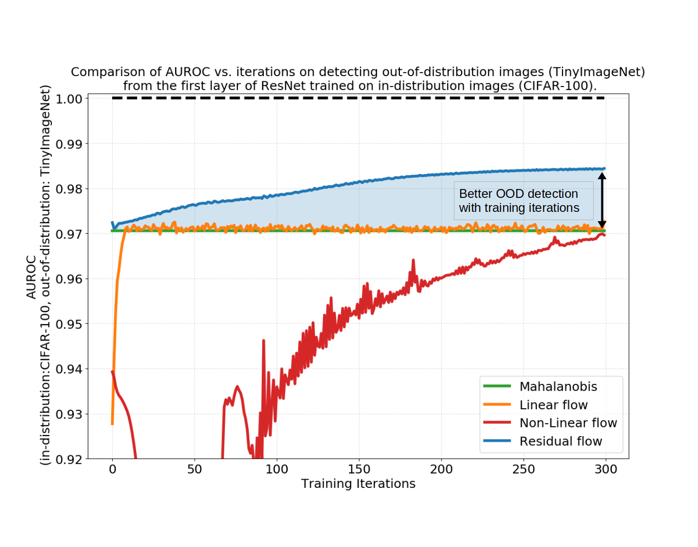

# Deep Residual Flow for Out of Distribution Detection
An implementation of the Residual Flow algorithm for out-of-distribution detection. 
Some code was adopted from [deep_Mahalanobis_detector](https://github.com/pokaxpoka/deep_Mahalanobis_detector) and [RealNVP](https://github.com/tensorflow/models/tree/master/research/real_nvp)
```
E. Zisselman, A. Tamar. "Deep Residual Flow for Out of Distribution Detection". CVPR 2020.
``` 
\[[arXiv](https://arxiv.org/abs/2001.05419)\]



## Citing Residual Flow for OOD Detection 
```
@InProceedings{Zisselman_2020_CVPR,
    author = {Zisselman, Ev and Tamar, Aviv},
    title = {Deep Residual Flow for Out of Distribution Detection},
    booktitle = {The IEEE Conference on Computer Vision and Pattern Recognition (CVPR)},
    month = {June},
    year = {2020}
}
```

## Dependencies
Tested on Ubuntu Linux 18.04.04 and Python 3.7, and requires PyTorch to be installed:

* [PyTorch](http://pytorch.org/): Requires 1 GPU with CUDA 10.2 support.
* [scipy](https://github.com/scipy/scipy)
* [scikit-learn](http://scikit-learn.org/stable/)

## Links for downloading Out-of-Distribution Datasets
Datasets from [odin-pytorch](https://github.com/facebookresearch/odin) and [SVHN](http://ufldl.stanford.edu/housenumbers/):

* [Tiny-ImageNet (resize)](https://www.dropbox.com/s/kp3my3412u5k9rl/Imagenet_resize.tar.gz)
* [LSUN (resize)](https://www.dropbox.com/s/moqh2wh8696c3yl/LSUN_resize.tar.gz)
* [SVHN](http://ufldl.stanford.edu/housenumbers/)

Placed in `./data/`.

## Links for downloading Pre-trained Models
The pre-trained neural networks are from [deep_Mahalanobis_detector](https://github.com/pokaxpoka/deep_Mahalanobis_detector):  
1. DenseNets trained on CIFAR-10, CIFAR-100 and SVHN.
    * [DenseNet on CIFAR-10](https://www.dropbox.com/s/pnbvr16gnpyr1zg/densenet_cifar10.pth?dl=0) / [DenseNet on CIFAR-100](https://www.dropbox.com/s/7ur9qo81u30od36/densenet_cifar100.pth?dl=0) / [DenseNet on SVHN](https://www.dropbox.com/s/9ol1h2tb3xjdpp1/densenet_svhn.pth?dl=0)  
      
2. ResNets trained on CIFAR-10, CIFAR-100 and SVHN.
    * [ResNet on CIFAR-10](https://www.dropbox.com/s/ynidbn7n7ccadog/resnet_cifar10.pth?dl=0) / [ResNet on CIFAR-100](https://www.dropbox.com/s/yzfzf4bwqe4du6w/resnet_cifar100.pth?dl=0) / [ResNet on SVHN](https://www.dropbox.com/s/uvgpgy9pu7s9ps2/resnet_svhn.pth?dl=0)

Placed in `./pre_trained/`.

## Detecting Out-of-Distribution Samples (Residual Flow detector)

### 1. Feature extraction and Residual Flow training 
```
# extract feature activations from classification network 
python Residual_flow_prepare.py --dataset cifar10 --net_type resnet --gpu 0

# Residual Flow training - trained per target network layer [0..N]
#                          where N = 3 for DenseNet and N = 4 for ResNet 
python Residual_flow_train.py --num_iter 2000 --net_type resnet --dataset cifar10 --layer 1 --gpu 0
```

### 2. Extract Residual Flow OOD detection score
```
# model: ResNet, in-distribution: CIFAR-10, gpu: 0
python Residual_flow_test_processing.py --net_type resnet --dataset cifar10

# (optional) comparison with Mahalanobis detector
python OOD_Generate_Mahalanobis.py --dataset cifar10 --net_type resnet --gpu 0
```

### 3. Train a simple regression detector
```
# model: ResNet
python OOD_Regression_Residual_flow.py --net_type resnet

# (optional) comparison with Mahalanobis detector
python OOD_Regression_Mahalanobis.py --net_type resnet
```


